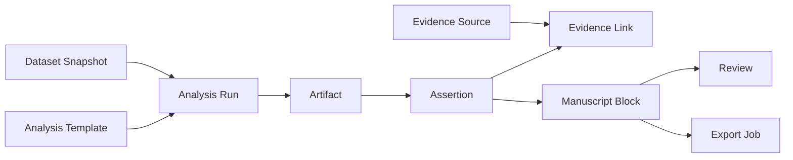

# DR-OS Core Data Model

## 1. 目标

本文件定义 DR-OS 的目标数据模型。重点不是“有哪些表”，而是把平台收敛成一条可计算、可核验、可审计的 lineage。

当前对齐基线：

- 概念设计：本文件
- SQL 基线：`sql/ddl_research_ledger_v2.sql`
- 词表约束：`docs/glossary.md`
- 路由目录：`docs/fastapi-route-catalog.md`
- 事件契约：`docs/event-contracts.md`

统一词表：

- 租户边界：`tenant`, `principal`, `project`
- 数据执行链：`dataset`, `dataset_snapshot`, `workflow_instance`, `workflow_task`, `analysis_run`, `artifact`, `lineage_edge`
- 证据写作链：`evidence_source`, `evidence_chunk`, `assertion`, `evidence_link`, `manuscript`, `manuscript_block`, `block_assertion_link`
- 治理链：`review`, `export_job`, `audit_event`

除以上命名外，不再保留旧对象名作为设计入口。

## 2. 建模原则

1. `Artifact` 是第一公民，不只是附件。
2. `Assertion` 是文稿、证据、统计结果之间的桥。
3. 所有业务对象都必须落到 `tenant_id` 和 `project_id` 边界内。
4. 版本化对象优先新建版本，不原地覆盖。
5. `artifact / assertion / evidence_link / audit_event` 默认 append-only。
6. 文件内容不直接入库，数据库只存 `storage_uri + sha256 + metadata`。
7. 所有用户可见事实必须能追到 `assertion_id`。
8. timeline、inspector、resume 都是 ledger projection，不是新的真相表。

## 3. Artifact Lineage DAG

## 3.1 派生产品视图

以下能力是产品一等交互面，但都必须由现有 canonical object 派生，不能新增“聊天真相层”：

- `project_timeline`
  - 来源：`workflow_instances`、`workflow_tasks`、schema-backed domain events、`audit_events`
  - 用途：展示 `数据导入中 / 模板运行中 / 证据核验中 / 稿件待审中`
- `run_visualization`
  - 来源：`workflow_tasks`、`analysis_runs.runtime_manifest_json`、关联 `artifacts`
  - 用途：解释当前 run 处于哪一阶段、卡在哪一步、已经产出了什么
- `artifact_inspector`
  - 来源：`lineage_edges`、`assertions`、`evidence_links`、`block_assertion_links`、`reviews`、`export_jobs`
  - 用途：支持 `artifact -> assertion -> evidence -> manuscript block` 的双向跳转
- `resume_entrypoint`
  - 来源：`workflow_instances.parent_workflow_id`、`analysis_runs.rerun_of_run_id`、`artifacts.superseded_by`、`manuscript_blocks.version_no`
  - 用途：为 rollback / resume 提供稳定入口，不允许原地改写历史对象
- `discussion_mode`
  - 定义：`analysis_planning` workflow 的一种交互模式，不是新的持久化对象
  - durable output：workflow task payload、planning artifact、review、audit_event

## 4. 核心对象分层

### 4.1 租户与权限层

- `tenants`
- `principals`
- `projects`
- `project_members`

### 4.2 数据与执行层

- `datasets`
- `dataset_snapshots`
- `analysis_templates`
- `workflow_instances`
- `workflow_tasks`
- `analysis_runs`
- `artifacts`
- `lineage_edges`

### 4.3 证据与写作层

- `evidence_sources`
- `evidence_chunks`
- `assertions`
- `evidence_links`
- `manuscripts`
- `manuscript_blocks`
- `block_assertion_links`

### 4.4 审核与治理层

- `reviews`
- `export_jobs`
- `audit_events`

## 5. 关键实体

### 5.1 `tenants`

用途：机构或部署租户边界。

关键字段：

- `id`
- `name`
- `tier`
- `deployment_mode`
- `status`

### 5.2 `principals`

用途：用户或服务账号。

关键字段：

- `id`
- `tenant_id`
- `subject_type`
- `external_sub`
- `email`
- `display_name`
- `status`

约束：

- `unique(tenant_id, external_sub)`

### 5.3 `projects`

用途：项目聚合根。

关键字段：

- `id`
- `tenant_id`
- `name`
- `project_type`
- `status`
- `compliance_level`
- `owner_id`
- `active_manuscript_id`

推荐枚举：

- `project_type`: `public_omics`, `clinical_retrospective`, `case_report`, `grant`
- `status`: `draft`, `running`, `review_required`, `approved`, `archived`

### 5.4 `project_members`

用途：项目成员与细粒度权限。

关键字段：

- `project_id`
- `principal_id`
- `role`
- `scopes_json`
- `joined_at`

### 5.5 `datasets`

用途：数据集逻辑对象，不等于快照。

关键字段：

- `id`
- `tenant_id`
- `project_id`
- `source_kind`
- `display_name`
- `source_ref`
- `pii_level`
- `license_class`
- `current_snapshot_id`

### 5.6 `dataset_snapshots`

用途：不可变数据快照，是分析运行的直接输入。

关键字段：

- `id`
- `dataset_id`
- `snapshot_no`
- `object_uri`
- `input_hash_sha256`
- `row_count`
- `column_schema_json`
- `deid_status`
- `phi_scan_status`

约束：

- `unique(dataset_id, snapshot_no)`
- `unique(dataset_id, input_hash_sha256)`

### 5.7 `analysis_templates`

用途：白名单模板注册表，对应审核过的 Report Bundle。

关键字段：

- `id`
- `tenant_id nullable`
- `code`
- `version`
- `name`
- `image_digest`
- `script_hash`
- `param_schema_json`
- `output_schema_json`
- `golden_dataset_uri`
- `doc_template_uri`
- `review_status`
- `approved_by`
- `approved_at`

### 5.8 `workflow_instances`

用途：业务状态机实例，是系统主干流程真相源。

关键字段：

- `id`
- `tenant_id`
- `project_id`
- `workflow_type`
- `state`
- `current_step`
- `parent_workflow_id`
- `runtime_backend`
- `started_by`

关键约束：

- 只有 `Workflow Service` 能迁移 `state`
- Agent 只能返回建议状态
- `parent_workflow_id` 用于表达 resume / fork 自历史 workflow 继续，而不是修改原 workflow 状态
- `workflow_type` 可以用于表达 `analysis_planning` 这类前置 planning workflow

### 5.9 `workflow_tasks`

用途：工作流步骤粒度状态。

关键字段：

- `id`
- `workflow_instance_id`
- `task_key`
- `task_type`
- `state`
- `assignee_id`
- `input_payload_json`
- `output_payload_json`
- `retry_count`

说明：

- `input_payload_json / output_payload_json` 可以承载结构化 phase label、checkpoint 摘要、阻断原因和待人工确认项
- `workflow_tasks` 不保存未核验统计结果，也不替代 artifact / assertion

### 5.10 `analysis_runs`

用途：一次标准化分析执行记录。

关键字段：

- `id`
- `tenant_id`
- `project_id`
- `workflow_instance_id`
- `snapshot_id`
- `template_id`
- `state`
- `params_json`
- `param_hash`
- `random_seed`
- `container_image_digest`
- `repro_fingerprint`
- `runtime_manifest_json`
- `input_artifact_manifest_json`
- `job_ref`
- `rerun_of_run_id`
- `error_class`
- `error_message_trunc`

`repro_fingerprint` 建议计算：

`sha256(snapshot_hash + template_version + script_hash + param_hash + random_seed + image_digest)`

说明：

- `runtime_manifest_json` 应记录 runner 模式、阶段 checkpoint、输入输出摘要和可视化所需的稳定元数据
- `rerun_of_run_id` 用于表达分析恢复、重跑或基于历史 run 的新分支

### 5.11 `artifacts`

用途：图表、表格、json、log、docx、pdf、zip 等统一工件表。

关键字段：

- `id`
- `tenant_id`
- `project_id`
- `run_id`
- `artifact_type`
- `output_slot`
- `storage_uri`
- `mime_type`
- `sha256`
- `size_bytes`
- `metadata_json`
- `superseded_by`

约束：

- `unique(sha256, storage_uri)`
- `unique(run_id, artifact_type, output_slot) where output_slot is not null`
- 不允许原地覆盖

说明：

- `metadata_json` 可以存放 Inspector 所需的展示提示，例如图表面板、统计段落键、生成来源摘要
- `output_slot` 是 runner / artifact emitter 为稳定输出位点声明的正式字段，用于 rerun supersede 和 inspector 对位
- `metadata_json` 不能替代显式 lineage edge、assertion source、evidence link 或 `output_slot`

### 5.12 `lineage_edges`

用途：通用血缘边，支撑 lineage explorer。

关键字段：

- `id`
- `tenant_id`
- `project_id`
- `from_kind`
- `from_id`
- `edge_type`
- `to_kind`
- `to_id`

推荐边类型：

- `input_of`
- `emits`
- `derives`
- `supersedes`
- `grounds`
- `cited_by`
- `attached_to`
- `reviewed_by`
- `exports`

### 5.13 `evidence_sources`

用途：文献源主表，保存标准化元数据。

关键字段：

- `id`
- `source_type`
- `external_id_norm`
- `doi_norm`
- `title`
- `journal`
- `pub_year`
- `pmid`
- `pmcid`
- `license_class`
- `oa_subset_flag`
- `metadata_json`
- `cached_at`

说明：

- 文献实体以 source 级别去重，不和项目强绑定
- 与项目的关系主要通过 `evidence_links` 和引用行为体现

### 5.14 `evidence_chunks`

用途：检索和 span 定位的 chunk 层。

关键字段：

- `id`
- `evidence_source_id`
- `chunk_no`
- `section_label`
- `text`
- `char_start`
- `char_end`
- `token_count`
- `embedding`
- `lexical_tsv`

实现建议：

- MVP 先放 PostgreSQL + pgvector
- 规模变大后再复制到独立 hybrid retrieval 引擎

### 5.15 `assertions`

用途：系统内“可引用事实”的最小单位。

关键字段：

- `id`
- `tenant_id`
- `project_id`
- `assertion_type`
- `text_norm`
- `numeric_payload_json`
- `source_run_id`
- `source_artifact_id`
- `source_span_json`
- `claim_hash`
- `state`
- `supersedes_assertion_id`

推荐枚举：

- `assertion_type`: `background`, `method`, `result`, `limitation`
- `state`: `draft`, `verified`, `blocked`, `stale`

强约束：

- UI 中所有结果句、方法句、背景句都必须能追到 `assertion_id`
- 未绑定 source 的 assertion 不允许进入 approved manuscript block

### 5.16 `evidence_links`

用途：Assertion 与文献证据的绑定。

关键字段：

- `id`
- `tenant_id`
- `project_id`
- `assertion_id`
- `evidence_source_id`
- `relation_type`
- `source_chunk_id`
- `source_span_start`
- `source_span_end`
- `excerpt_hash`
- `verifier_status`
- `confidence`

推荐枚举：

- `relation_type`: `supports`, `contradicts`, `method_ref`, `background_ref`

### 5.17 `manuscripts`

用途：稿件聚合对象。

关键字段：

- `id`
- `tenant_id`
- `project_id`
- `manuscript_type`
- `title`
- `state`
- `current_version_no`
- `style_profile_json`
- `target_journal`
- `created_by`

说明：

- `manuscript` 的 rollback 语义不是把 `current_version_no` 改回去，而是从历史 `version_no` 派生新的 current version

### 5.18 `manuscript_blocks`

用途：结构化 block，不等于 assertion。

关键字段：

- `id`
- `tenant_id`
- `project_id`
- `manuscript_id`
- `version_no`
- `section_key`
- `block_order`
- `block_type`
- `content_md`
- `status`
- `supersedes_block_id`

说明：

- `version_no` 是稿件级 rollback / resume 的核心锚点
- `supersedes_block_id` 用于在同一稿件内保留 block 级替换链

### 5.19 `block_assertion_links`

用途：block 与 assertion 的显式多对多映射。

关键字段：

- `block_id`
- `assertion_id`
- `render_role`
- `display_order`

强约束：

- 文稿 block 不直接引用 `analysis_run`
- 所有数值和关键表述必须先通过 assertion 进入 block

### 5.20 `reviews`

用途：审核单对象。

关键字段：

- `id`
- `tenant_id`
- `project_id`
- `review_type`
- `target_kind`
- `target_id`
- `target_version_no`
- `state`
- `reviewer_id`
- `checklist_json`
- `comments`
- `decided_at`

说明：

- 当 `target_kind=manuscript` 时，`target_version_no` 用于把 review 绑定到明确稿件版本，避免旧版本审核状态污染当前 manuscript chain
- 其他 target kind 的 review 保持 `target_version_no = null`

### 5.21 `export_jobs`

用途：导出任务。

关键字段：

- `id`
- `tenant_id`
- `project_id`
- `manuscript_id`
- `format`
- `state`
- `output_artifact_id`
- `requested_by`
- `requested_at`
- `completed_at`

### 5.22 `audit_events`

用途：append-only 审计日志。

关键字段：

- `id`
- `tenant_id`
- `project_id`
- `actor_id`
- `actor_type`
- `event_type`
- `target_kind`
- `target_id`
- `request_id`
- `trace_id`
- `payload_json`
- `prev_hash`
- `event_hash`

设计要点：

- `prev_hash + event_hash` 形成链式校验
- 关键动作都必须入审计
- 归档层再做 WORM

## 6. 版本、恢复与续做语义

- `dataset rollback`
  - 语义：选择历史 `dataset_snapshot` 并启动新的 workflow
  - 约束：历史 snapshot 不可变
- `workflow resume`
  - 语义：创建新的 child `workflow_instance`，通过 `parent_workflow_id` 连接父链
  - 约束：原 workflow 保持原状态，审计中显式记录为什么恢复、由谁恢复
- `analysis rerun / resume`
  - 语义：创建新的 `analysis_run`
  - 链路：通过 `rerun_of_run_id` 连接 run 链，通过 artifact `supersedes` 连接输出链
- `manuscript rollback / resume`
  - 语义：从历史 `version_no` 派生新的 current version，而不是覆盖旧版本
  - 约束：导出永远绑定某个明确版本，verify 结果也必须带版本号

## 7. 行级安全与追加写

关键表默认要求：

- `ENABLE ROW LEVEL SECURITY`
- `FORCE ROW LEVEL SECURITY`

必须启用的表：

- `projects`
- `project_members`
- `datasets`
- `dataset_snapshots`
- `workflow_instances`
- `workflow_tasks`
- `analysis_runs`
- `artifacts`
- `assertions`
- `evidence_links`
- `manuscripts`
- `manuscript_blocks`
- `reviews`
- `export_jobs`
- `audit_events`

append-only 默认对象：

- `artifacts`
- `assertions`
- `evidence_links`
- `audit_events`

## 8. 结论

DR-OS 的数据模型重点不是“把多少对象存进库”，而是把所有关键对象都纳入同一条可追溯链：

`tenant -> project -> snapshot -> run -> artifact -> assertion -> evidence / manuscript -> review / export -> audit`

只要这条链是稳定的，前端、Agent、模板数量和部署形态都可以渐进增强。
