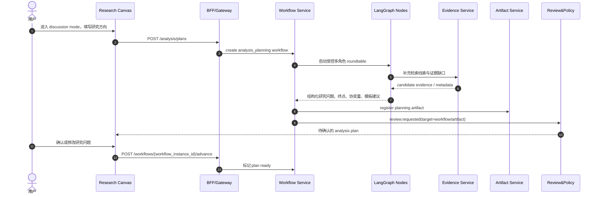
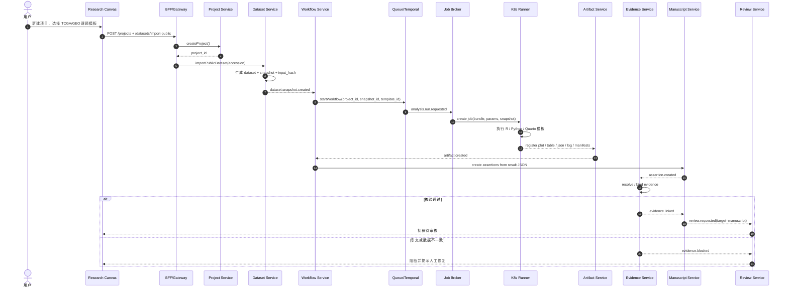
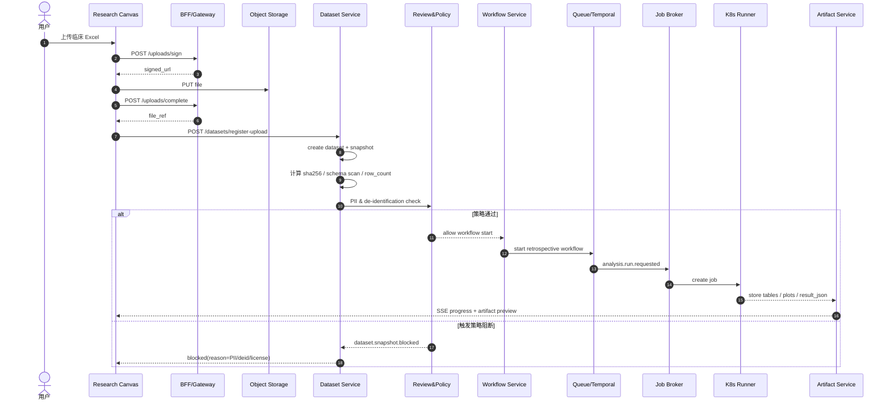
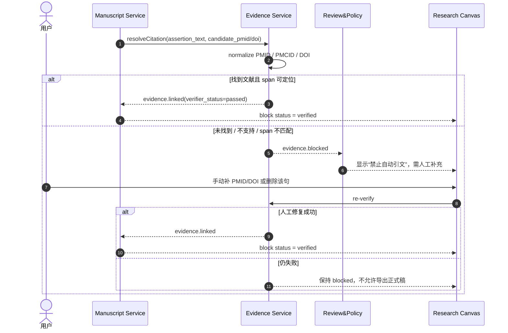
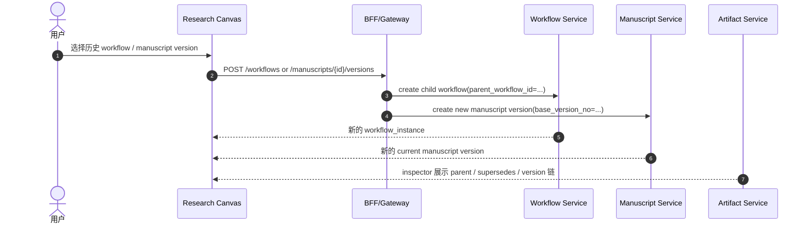
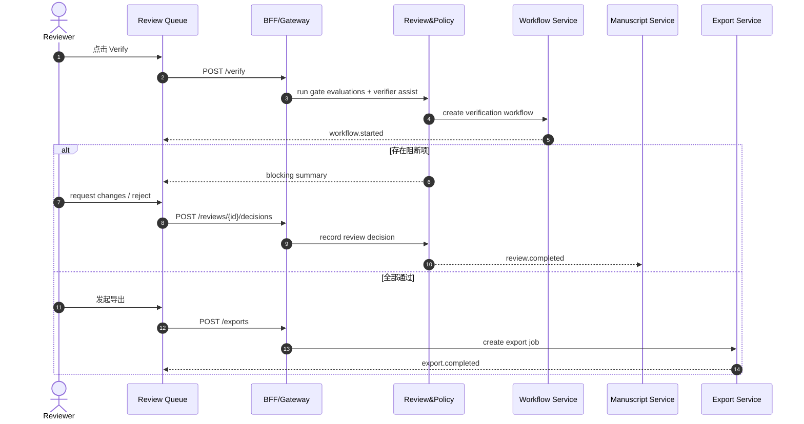

# DR-OS Event Sequences

## 1. 目标

本文件定义 DR-OS 的关键时序流。它不是接口文档，而是系统行为文档，用于统一前端、控制面、工作流、执行面和账本层的协作方式。

事件名与幂等键的权威定义见 `docs/event-contracts.md` 和 `contracts/events/*.schema.json`。

## 2. 事件设计原则

1. 业务状态变更优先落账，再广播事件。
2. 长任务状态由 `workflow_instances` 驱动，而不是由前端轮询猜测。
3. 任何可导出的内容都必须经过 verify / review / export 三步。
4. 任何跨对象引用都必须最终落到 assertion 或 lineage 上。
5. 事件必须带 `tenant_id`、`project_id`、`trace_id`、`idempotency_key`。
6. `Research Canvas` 的 timeline 是领域事件、workflow detail 和 audit_event 的联合投影，不是 raw agent transcript。
7. rollback / resume 通过 child workflow、新版本和 supersede 链表达，不设计 mutable undo 事件。

## 3. 前置流程：立题讨论 -> Analysis Plan

补充：

- discussion transcript 不是正式真相源；durable output 只能是 planning artifact、workflow task payload、review 和 audit_event
- 该流程的实时 UI 主要依赖 `workflow.started`、`review.requested` 与通用审计事件投影

## 4. 主流程一：公共数据库课题 -> 分析 -> 证据绑定 -> 初稿

补充：

- 浏览器侧 `Research Canvas` 当前通过 frontend 同源 `/api/projects/{project_id}/events` proxy 订阅 Gateway SSE，而不是在页面直接拼 backend URL
- workspace 左栏当前会把 recent audit seed 与 live SSE 事件合并展示；用户选中某条事件后，Inspector 会同步显示 `trace / request / payload` 和跨对象跳转
- 推荐阶段标签：
  - `数据导入中`：`workflow.state in retrieving|structuring`
  - `模板运行中`：`analysis.run.requested` 到 `analysis.run.succeeded|failed`
  - `证据核验中`：`assertion.created` 到 `evidence.linked|evidence.blocked`
  - `稿件待审中`：`review.requested`

核心事件：

- `project.created`
- `dataset.snapshot.created`
- `workflow.started`
- `analysis.run.requested`
- `analysis.run.succeeded`
- `artifact.created`
- `assertion.created`
- `evidence.linked`
- `evidence.blocked`
- `review.requested`

## 5. 主流程二：临床 Excel 上传 -> 存证 -> 脱敏门禁 -> 统计分析

补充：

- artifact payload 下载当前不在浏览器侧直接消费 gateway `download-url`；前端会调用同源 `/api/projects/{project_id}/artifacts/{artifact_id}/download` route，由服务端解析本地 `file://` 或执行外部重定向
- 推荐阶段标签：
  - `数据导入中`：上传完成到 policy check 返回
  - `模板运行中`：`analysis.run.requested` 之后
  - `证据核验中`：analysis 后的 assertion / evidence 阶段
  - `稿件待审中`：有 review request 但尚未决定

核心事件：

- `dataset.snapshot.created`
- `dataset.snapshot.blocked`
- `workflow.started`
- `analysis.run.requested`
- `analysis.run.succeeded`
- `analysis.run.failed`
- `artifact.created`

## 6. 主流程三：反幻觉引文熔断 -> 人工修复 -> 重新核验

核心事件：

- `assertion.created`
- `evidence.linked`
- `evidence.blocked`
- `review.requested`

## 7. 产品交互：版本级 Rollback / Resume

补充：

- 该交互不引入 `undo` 事件；链路依赖 `parent_workflow_id`、artifact `supersedes`、`version_no` 和对应审计
- 历史对象保持只读，新版本才允许继续写作、核验和导出

## 8. 审核、核验与导出

核心事件：

- `workflow.started`
- `review.requested`
- `review.completed`
- `export.completed`

## 9. 推荐事件命名集合

当前主链路只使用以下领域事件：

- `project.created`
- `dataset.snapshot.created`
- `dataset.snapshot.blocked`
- `workflow.started`
- `analysis.run.requested`
- `analysis.run.succeeded`
- `analysis.run.failed`
- `artifact.created`
- `assertion.created`
- `evidence.linked`
- `evidence.blocked`
- `review.requested`
- `review.completed`
- `export.completed`

## 10. 结论

DR-OS 最关键的不是“能不能生成一段话”，而是：

- 这段话对应哪个 assertion
- 这个 assertion 对应哪些 artifact 和 evidence
- 这些对象经过了哪些 verify / review
- 当前导出版本是否能完整回放这条链路

时序设计的目标，就是让这些问题都能被系统默认回答。
