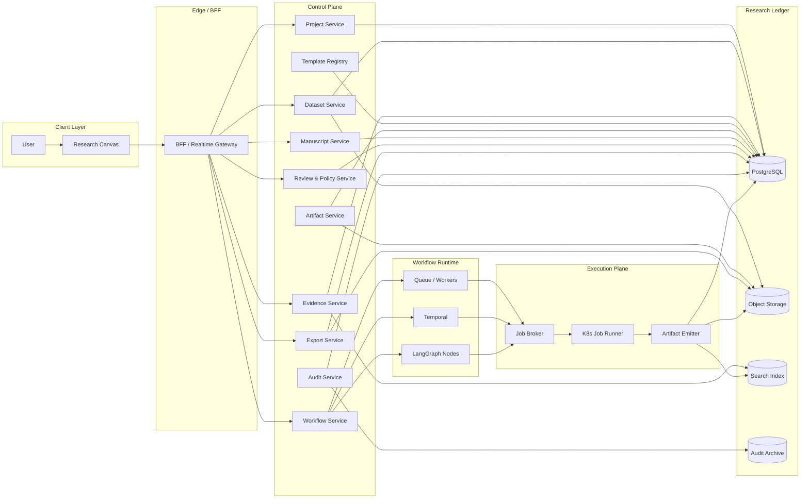

# DR-OS Module Boundaries

## 1. 目标

本文件把 DR-OS 从“组件列表”收敛为“可拆任务的边界表”。

本文件只定义模块 ownership、同步接口和异步事件边界。领域对象和词表以 `docs/product-architecture.md` 与 `docs/core-data-model.md` 为准。

核心原则只有一句话：

`Canvas 不持有真相，Workflow 不跑重计算，Execution Plane 不持有业务语义，Ledger 才是最终真相源。`

## 2. 总体边界图

## 3. 边界原则

1. `Research Canvas` 不直接写数据库。
2. `BFF / Gateway` 不承载业务真相。
3. `Workflow Service` 只推进状态，不执行长时计算。
4. `Execution Plane` 只生产 artifact，不决定业务语义。
5. `Evidence Service` 才能写 evidence source 和 evidence link。
6. `Manuscript Service` 只能消费 assertion，不直接“发明事实”。
7. `Audit Service` 只追加写，不回写业务对象状态。
8. timeline、inspector、discussion workspace 都是 read model / interaction surface，不持有业务真相。
9. rollback / resume 由 Workflow / Manuscript / Artifact 相关服务创建新谱系对象完成，不由 Canvas 执行“撤销”。

## 4. 模块边界表

| 模块 | 它拥有的东西 | 它不拥有的东西 | 同步接口 | 异步事件 | 真相存储 |
| :--- | :--- | :--- | :--- | :--- | :--- |
| Research Canvas | 页面状态、交互、草稿 UI | 项目状态真相、审计日志 | REST / SSE | 无 | 无 |
| BFF / Gateway | 会话、租户识别、bearer token / dev header auth context、OIDC discovery / JWKS cache / key rotation refresh、token introspection、`jti` denylist gate、签名上传、实时推送 | 业务规则 | `/v1/session` `/v1/uploads/*` `/v1/projects/{project_id}/events` `/v1/projects/{project_id}/artifacts/{artifact_id}/download-url` | `client.upload.completed` | 无 |
| Project Service | Project 聚合、成员关系、项目状态 | 数据快照、分析结果、证据缓存 | `create/update/list project` | `project.created` `project.archived` | PostgreSQL |
| Dataset Service | 数据注册、快照、哈希、schema scan | 分析逻辑、证据绑定、审核结论 | `import/register snapshot` | `dataset.snapshot.created` `dataset.snapshot.blocked` | PostgreSQL + Object Storage |
| Evidence Service | PMID/PMCID/DOI 归一化、文献缓存、chunk、evidence link | 稿件版式、统计分析 | `search/resolve/bind evidence` | `evidence.linked` `evidence.blocked` | PostgreSQL + Search Index |
| Workflow Service | 状态机、步骤推进、人工审核挂起点、analysis plan / analysis run 协调 | 计算执行、文献全文处理 | `plan/start/advance/cancel workflow` | `workflow.started` | PostgreSQL |
| Template Registry | 模板版本、镜像 digest、schema、golden dataset | 项目级运行数据 | `publish/get template` | `template.published` | PostgreSQL |
| Artifact Service | artifact 元数据、sha256、存储定位、lineage explorer 视图 | 稿件逻辑、证据语义 | `register/get/list artifact + lineage` | `artifact.created` | PostgreSQL + Object Storage |
| Manuscript Service | 稿件版本、block、assertion 创建与渲染映射 | 文献抓取、统计执行 | `create assertion/block/version/render` | `assertion.created` `review.requested` | PostgreSQL |
| Review & Policy Service | 审核单、审批状态、dataset policy checks、verify gate | 原始分析结果、文献检索 | `run dataset policy checks / create review / decide review / run verify / verify evidence link` | `review.requested` `review.completed` | PostgreSQL |
| Export Service | docx/pdf/zip 导出任务 | 项目逻辑、证据核验规则 | `create/get export job` | `export.completed` | PostgreSQL + Object Storage |
| Audit Service | append-only 审计日志、链式 hash、归档 | 业务对象内容 | internal only | `audit.appended` | PostgreSQL + WORM |
| Queue / Workers | 短中时任务执行状态 | 业务真相、租户权限 | internal only | 透传 runtime 事件 | Queue backend |
| Temporal | durable workflow state | 业务实体最终状态 | internal only | 透传 runtime 事件 | Temporal store |
| LangGraph Nodes | 局部 Agent 节点状态 | 主流程真相、数据库最终状态 | internal only | 透传 runtime 事件 | runtime memory / checkpoints |
| Job Broker | run 请求投递、取消执行 | 结果语义、人工审批 | `schedule/cancel job` | `analysis.run.requested` | runtime state |
| K8s Job Runner | 模板执行、图表/JSON 生成 | 项目状态、审核状态 | internal only | `analysis.run.succeeded` `analysis.run.failed` | 临时容器 |
| Artifact Emitter | artifact 落账、对象存储写入、索引回填 | 审核和写作逻辑 | internal only | `artifact.created` | PostgreSQL + Object Storage |

## 5. 产品工作台与 Owner

| 产品工作台 | 本质 | 主要 Owner | 关键约束 |
| :--- | :--- | :--- | :--- |
| `Live Timeline / Run Visualization` | `workflow + event + audit` 投影 | Gateway + Workflow Service + Audit Service | 只展示阶段、对象、阻断原因和产物，不展示不可追溯推理 transcript |
| `Versioned Rollback / Resume` | 基于历史对象创建新的 child workflow / new version | Workflow Service + Manuscript Service + Artifact Service | 不原地修改历史状态；必须保留 `parent_workflow_id / supersedes / version_no` 链 |
| `Artifact Inspector` | `artifact / assertion / evidence / manuscript` 双向邻接视图 | Artifact Service + Evidence Service + Manuscript Service | 跳转必须落到 canonical object，不能依赖页面本地拼接假链路 |
| `Discussion Mode` | `analysis_planning` workflow 的前置交互层 | Workflow Service + Analysis Agent + Search Agent + Review & Policy | durable output 只能是计划结果、artifact、review 和 audit_event |

## 6. 强约束

### 6.1 Research Canvas

- 不直接访问 PostgreSQL
- 不直接访问对象存储 bucket
- 不直接调用 NCBI

### 6.2 BFF / Gateway

- 只做 session、tenant guard、signed URL、实时推送
- `GET /events` 的产品职责是投影项目 timeline，不是透出 Agent 原始对话
- 当前仓库已支持 JWT bearer、OIDC discovery、JWKS cache/rotation、token introspection，并在 `mixed` 模式下保留开发态 header/context 回退
- project-scoped 最终授权以 `principal scope_tokens ∩ membership scope_tokens` 为准；Gateway 只负责注入上下文，不越权决定业务对象访问
- 不定义 project-scoped 业务对象 schema
- 不持有流程状态真相
- 不执行分析逻辑

### 6.3 Workflow Service

- 只做状态机
- 只有它能迁移任务状态
- 拥有 `parent_workflow_id` 驱动的 resume / fork 语义
- `analysis_planning` discussion mode 由它驱动，不由 LangGraph 单独决定主流程
- 不执行 shell、统计脚本、批量外部抓取

### 6.4 Execution Plane

- 只能执行白名单模板
- 默认 rootless
- 默认断网
- 只能写 artifact，不直接改业务表

### 6.5 Evidence Service

- Entrez 结构化检索优先
- 无 API key 时 `<=3 req/s`
- 有 API key 时 `<=10 req/s`
- 非 OA 文献只抓 metadata
- artifact inspector 中的证据跳转必须落回 `evidence_source / evidence_link`，不能落成自由文本摘要

### 6.6 Manuscript Service

- 只能消费 verified assertion
- block 必须通过 assertion 建立追溯
- 稿件 rollback / resume 通过新建版本完成，不允许原地篡改历史版本
- 不得直接从 analysis run 原始结果拼正文

### 6.7 Audit Service

- append-only
- 关键对象写链式 hash
- 不接受 update / delete 语义

## 7. MVP 与后续演进

### MVP

- Research Canvas
- BFF / Gateway
- Project / Dataset / Workflow / Evidence / Artifact / Manuscript / Review / Export / Audit Services
- Queue / Workers
- PostgreSQL + Object Storage + pgvector
- project timeline + inspector 基础投影

### P1

- Temporal
- 临床 Excel 流程
- 更完整的审核和导出链路
- workflow / manuscript 级 resume 分支
- discussion mode 前置 planning workflow

### P2

- 私有化部署
- 科室治理
- 更细粒度配额、归档和运维能力

## 8. 结论

DR-OS 的边界不是按“几个 Agent”划分，而是按以下闭环划分：

- 控制面管理项目、状态、证据、审批
- 执行面稳定地产出 artifact
- 账本层保存 append-only lineage 和 audit

只有这三层边界清楚，工程拆分才不会把“检索、分析、写作、审核”重新糊成一个大服务。
