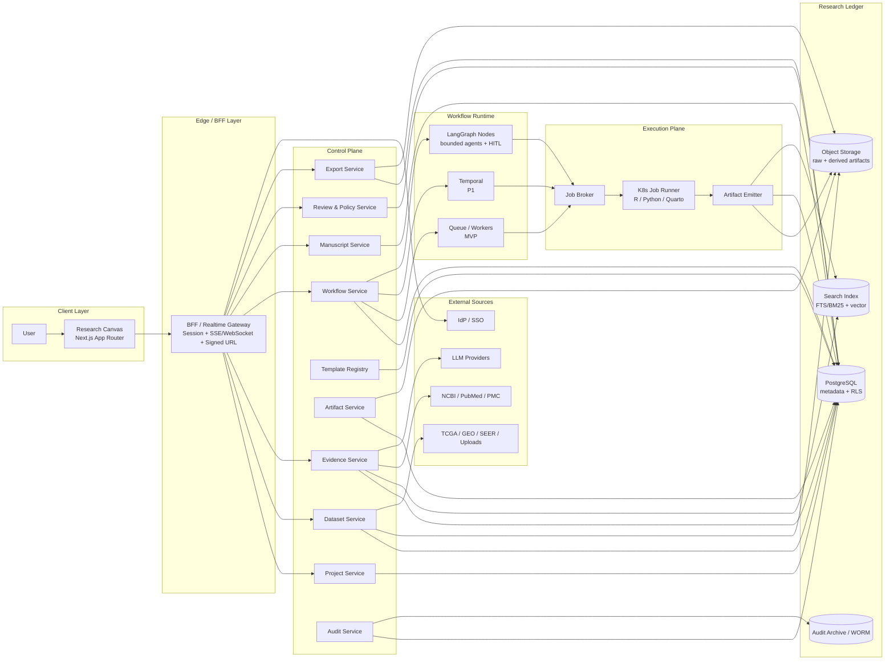

# DR-OS Product Architecture

## 1. 文档信息

- 产品名称：Doctor Research OS（DR-OS）
- 文档版本：v2.2
- 文档状态：Enhanced Product Surface Baseline
- 仓库入口：见 `README.md`
- 实现快照：见 `docs/implementation-status.md`
- 本地部署：见 `docs/local-deployment.md`
- 默认目标：
  - MVP：公共数据库课题 + 标准化统计分析 + 可溯源写作
  - P1：临床 Excel 回顾性研究 + 审计 / 审核
  - P2：科室治理 + 私有化 / 院内部署

## 1.1 权威事实来源

本项目只保留一套架构词表和一套约束边界。文档冲突时，按以下顺序裁决：

1. `docs/product-architecture.md`
2. `docs/core-data-model.md`
3. `docs/glossary.md`
4. `docs/module-boundaries.md`
5. `docs/api-contracts.md`
6. `docs/fastapi-route-catalog.md`
7. `docs/event-contracts.md`
8. `contracts/events/*.schema.json`
9. `AGENTS.md`
10. `sql/ddl_research_ledger_v2.sql`

各文件职责固定：

- `docs/product-architecture.md`：产品目标、架构原则、唯一主词表
- `docs/core-data-model.md`：Research Ledger 对象模型
- `docs/glossary.md`：唯一术语表与旧词禁用清单
- `docs/module-boundaries.md`：服务和执行面的 ownership 边界
- `docs/api-contracts.md`：API 语义约束
- `docs/fastapi-route-catalog.md`：路由目录，不重复定义领域模型
- `docs/event-contracts.md` + `contracts/events/*.schema.json`：事件契约
- `AGENTS.md`：Agent 和控制面行为约束
- `sql/ddl_research_ledger_v2.sql`：唯一 SQL 设计基线

未出现在以上列表中的设计草稿、历史命名和兼容说明都不是当前事实来源，不再继续维护。

## 2. 产品定位

DR-OS 不是通用聊天助手，也不是开放式科研 Copilot。它是以 `Artifact Lineage` 为核心的医学科研工作台。

系统内最重要的三个对象：

- `Artifact`：数据快照、分析结果、图表、表格、导出稿、manifest
- `Assertion`：系统内可引用、可核验、可审计的最小“事实单元”
- `EvidenceLink`：Assertion 与 `EvidenceSource / EvidenceChunk` 的显式绑定

目标不是“让 Agent 更自由”，而是把以下链路做成系统默认能力：

`Dataset Snapshot -> Analysis Run -> Artifact -> Assertion -> EvidenceLink -> Manuscript Block -> Review -> Export`

在这个链路之上，产品层默认应该暴露四个工作台能力：

- `Live Timeline / Run Visualization`：让用户看到系统当前处于 `数据导入中 / 模板运行中 / 证据核验中 / 稿件待审中` 哪一阶段
- `Versioned Rollback / Resume`：回退与恢复作用在 `snapshot / workflow / analysis run / manuscript version`，而不是作用在 Agent 对话
- `Artifact Inspector`：围绕 artifact、assertion、evidence、manuscript block 做双向跳转
- `Discussion Mode`：在正式分析前，用受控多角色讨论沉淀研究问题、终点、协变量和分析计划

## 3. 架构原则

1. `Workflow-first, agent-last`。主干流程由确定性状态机驱动，Agent 只做局部智能节点。
2. `Artifact lineage first`。所有用户可见事实都必须回链到 Assertion，再回链到 Artifact 或 Evidence Source。
3. `Template over free-form`。分析逻辑来自白名单模板，不允许运行未审核统计代码。
4. `Evidence Control Plane` 独立存在。核验不是写作辅助，而是导出前门禁。
5. `Ledger first`。项目、快照、运行、artifact、assertion、review、audit 都是可追溯对象。
6. `Least privilege`。每个服务和 Agent 只能访问任务所需的最小数据。
7. `Append-only by default`。artifact、assertion、evidence_link、audit_event 默认追加写，不原地覆盖。
8. `Projection over transcript`。运行可视化来自 ledger、workflow detail 和 events 的投影，不来自 LLM 对话 transcript。
9. `Rollback creates new lineage`。回退与恢复必须创建新的 version / child workflow / rerun 链，不允许把历史对象“改回去”。
10. `Planning is gated`。立题讨论只能产出结构化计划和待确认项，不能直接越过模板白名单进入分析和写作。

## 4. 总体架构

## 5. 技术落点

### 5.1 前端与网关

- 前端：`Next.js App Router`
- 选择原因：原生支持 `Server Components`、`streaming`、长任务状态展示、Evidence Sidebar 和稿件预览
- BFF / Gateway：会话、租户识别、SSE / WebSocket、Signed URL

### 5.2 控制面

- API 控制面：`FastAPI`
- 约束：`BackgroundTasks` 仅用于响应后小任务
- 长流程、可恢复流程：交给 `Celery/Redis` 或 `Temporal`

### 5.3 执行面

- 计算执行：`Kubernetes Job`
- 模式：`run-to-completion`
- 默认约束：
  - `rootless`
  - 断网沙箱
  - `ttlSecondsAfterFinished` 自动清理
  - Runner 只写 Artifact，不直接写业务真相表

### 5.4 账本层

- 元数据：`PostgreSQL + RLS`
- 强制隔离：关键表启用 `FORCE ROW LEVEL SECURITY`
- 工件层：`Object Storage`
- 检索：`PostgreSQL FTS/BM25 + pgvector`
- 审计归档：`WORM`

### 5.5 产品工作台能力

- `Live Timeline / Run Visualization`
  - 数据源：`workflow_instances`、`workflow_tasks`、schema-backed domain events、`analysis_runs.runtime_manifest_json`、`audit_events`
  - 目标：回答“现在在做什么、卡在哪、产生了哪些 artifact、下一步等谁”
  - 明确不做：展示 token 级 Agent 自言自语或不可复算的推理碎片
- `Versioned Rollback / Resume`
  - 入口对象：历史 `dataset_snapshot`、`workflow_instance`、`analysis_run`、`manuscript` 版本
  - 行为语义：创建新的 child workflow、新的 analysis run 或新的 manuscript version；历史版本保持可追溯
  - 目标：支持“回到上一版图表/分析/稿件继续做”，而不是“撤销聊天”
- `Artifact Inspector`
  - 默认主链：`figure/table -> result_json -> assertion -> evidence_link -> manuscript_block -> review/export`
  - 要求：既能顺链向下看消费方，也能逆链向上看事实来源
- `Discussion Mode`
  - 定位：正式 analysis workflow 前的前置 planning workflow
  - 角色视角：`临床专家 / 统计顾问 / 文献秘书`
  - durable output：结构化 planning artifact、analysis plan、待审批 review items、audit_event
  - 非 durable 内容：讨论 transcript 本身

## 6. 控制面与 Agent 的边界

### 6.1 确定性服务

- `Workflow Service`：唯一的主流程状态机
- `Evidence Structuring Service`：规则抽取、字段映射、证据表生成
- `Evidence Control Plane`：
  - Citation Resolver
  - Claim-Evidence Binder
  - Data Consistency Checker
  - License Guard

### 6.2 Agent 组件

- `Search Agent`：检索改写、候选文献召回、rerank
- `Analysis Agent`：模板建议、参数 JSON 映射
- `Writing Agent`：基于 verified Assertion 生成受限自然语言
- `Verifier Agent`：仅做 LLM 辅助语义边界判定

强约束：

- Agent 输出必须结构化
- Agent 不能绕过 Evidence Control Plane
- Agent 不能修改审核后的统计逻辑
- `Verifier Agent` 不能单独阻断系统；它只输出结构化 verdict，最终阻断由 `Review & Policy Service` 或 `Workflow Service` 决策

### 6.3 前置讨论模式

`Discussion Mode` 不是新的主流程编排器，也不是新的真相层。它是 `analysis_planning` workflow 的一种产品交互形态：

- 用多角色视角帮助用户澄清研究问题、终点定义、纳排标准、协变量和证据缺口
- 由 `Workflow Service` 驱动，必要时调用 `Search Agent` 和 `Analysis Agent`
- 最终只允许沉淀为结构化计划结果、planning artifact、review items 和审计事件
- 不允许把讨论内容直接当作导出稿件、assertion 或模板执行输入

## 7. Evidence Control Plane

这是系统可信度的中心，而不是附属工具集。

### 7.1 Citation Resolver

- 标准化 `PMID / PMCID / DOI`
- 拉取元数据并做完整性校验
- 去重和对齐

### 7.2 Claim-Evidence Binder

- 校验 `ManuscriptBlock -> Assertion -> Artifact/Evidence` 的三级链路
- 检测 orphan block、dangling assertion、broken chain

### 7.3 Data Consistency Checker

- 正文数值 vs 结果 JSON
- 图表标注 vs 统计输出
- 表格行列 vs 原始计算结果
- 跨 Assertion 一致性

### 7.4 License Guard

- 区分 `metadata_only`、`PMC Open Access Subset`、受限来源
- 控制全文是否可程序化处理

外部数据访问约束：

- NCBI E-utilities：无 key `<=3 req/s`，有 key `<=10 req/s`
- 大批量请求：走 `EPost + EFetch`
- PMC 全文自动化挖掘：优先限定在 `PMC Open Access Subset`
- 非 OA 文献：只拉 metadata，不尝试全文下载

## 8. 核心流程

### 8.1 立题讨论与分析计划

`Project -> analysis_planning workflow -> role roundtable -> planning artifact -> human confirm -> analysis plan`

### 8.2 公共数据库课题

`Project -> Dataset Import -> Snapshot -> Workflow -> Analysis Run -> Artifacts -> Assertions -> Evidence Binding -> Manuscript Draft`

### 8.3 临床 Excel 回顾性研究

`Upload -> Snapshot -> PHI / De-id Check -> Workflow -> Standard Bundle -> Artifacts -> Assertions -> Review`

### 8.4 版本级恢复与续做

`Historical Snapshot/Run/Version -> Child Workflow or New Manuscript Version -> Verify -> Promote Current`

### 8.5 导出前门禁

`Verify -> Gate Evaluations -> Review Decision -> Export Job -> Export Artifact + Manifest`

## 9. 关键约束

1. 所有用户可见“事实”必须先成为 `assertion`。
2. 所有 `assertion` 必须至少绑定 `source_run_id / source_artifact_id` 或 `evidence_links`。
3. `project timeline`、`run visualization`、`artifact inspector` 都是 projection，不是新的真相对象。
4. `rollback / resume` 必须通过 `parent_workflow_id`、`rerun_of_run_id`、`supersedes`、`version_no` 等谱系字段表达，不允许原地回滚历史对象。
5. `manuscript_block` 不直接引用 `analysis_run`，只能引用 `assertion`。
6. 所有 artifact 不原地覆盖，只能新增并通过 `supersedes` 建立谱系。
7. `discussion mode` 只产生计划，不直接产生可导出的结果文本。
8. 所有导出前都必须经过 Evidence Control Plane 全链路校验。
9. 临床模式下，未脱敏数据不得进入外部模型。
10. 审计日志是 append-only，不允许回写修改。

## 10. 分阶段实施

### MVP

- 项目、数据集、快照、analysis run、artifact、audit 落账
- 公共数据库导入
- 标准化分析模板
- assertion 抽取
- 引文熔断
- 初稿生成
- 项目级实时 timeline 和阶段标签
- artifact inspector 基础跳转

### P1

- 临床 Excel 上传
- PHI / de-identification 门禁
- 审核流
- Temporal durable workflow
- 更完整的 review / export / audit
- workflow child branch 驱动的 rollback / resume
- discussion mode + planning artifact + analysis plan 审批
- 更丰富的 run visualization 和 checkpoint 展示

### P2

- 多租户科室治理
- 私有化部署
- 配额、审批、归档和运维治理

## 11. 结论

DR-OS 的关键不是“把 AI 接进来”，而是把 `project / snapshot / run / artifact / assertion / evidence / review / export` 串成一条可审计 lineage。

只要这条链先立住：

- 前端可以渐进增强
- Agent 可以逐步扩展
- 模板数量可以持续增加
- 私有化与合规要求也有稳定落点
